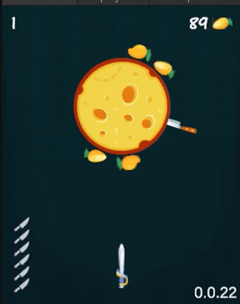

# Knife Hit


## Game Description

Knife Hit is an arcade-style game where players throw knives at a rotating target. The objective is to stick all available knives into the target without hitting any knives that are already embedded. The game features multiple levels with increasing difficulty, various knife skins, bonus items, and dynamic target rotation patterns.

### Gameplay Features
- **Knife Throwing Mechanics**: Tap/click to throw knives at the rotating target
- **Multiple Levels**: Progress through increasingly challenging levels
- **Knife Skins**: Unlock and customize different knife appearances
- **Bonus System**: Collect bonuses to help complete levels
- **Dynamic Targets**: Targets rotate at varying speeds and patterns
- **Collision Detection**: Avoid hitting already-placed knives
- **Level Editor**: Create and customize levels using Lua scripting

<details>
<summary>🎮 Gameplay Preview</summary>



</details>

## Technologies Used

### Game Engine
- **Unity 6** (Universal Render Pipeline - URP)

### Programming Languages
- **C#** - Main game logic
- **Lua** - Level scripting and customization

### Key Libraries & Frameworks
- **Zenject (Extenject)** - Dependency injection framework
- **UniRx** - Reactive extensions for Unity
- **UniTask** - Async/await support for Unity
- **DOTween** - Animation tweening library
- **Lua-CSharp** - Lua scripting integration
- **UniTask + DOTween** - Asynchronous animations

## Project Structure

```
Assets/
├── KnifeHit/           # Main game content
│   ├── Scripts/        # Game logic (C#)
│   ├── LevelData/      # Level configurations
│   ├── Prefs/          # Prefabs (knives, targets, bonuses)
│   ├── Animations/     # Game animations
│   └── Sprites/        # Game assets
├── Common/             # Shared utilities
├── ThirdParty/         # External libraries
└── Resources/          # Runtime resources
```

## Getting Started

1. Open the project in Unity 6
2. Open the scene: `Assets/KnifeHit/Scenes/KnifeHit.unity`
3. Press Play to start the game

## Level Editing

The game supports custom level creation using Lua scripting. Level logic can be modified through the Lua scripting system, allowing for custom target behaviors, knife patterns, and game rules.

---

**Note**: This is a prototype project demonstrating core gameplay mechanics.